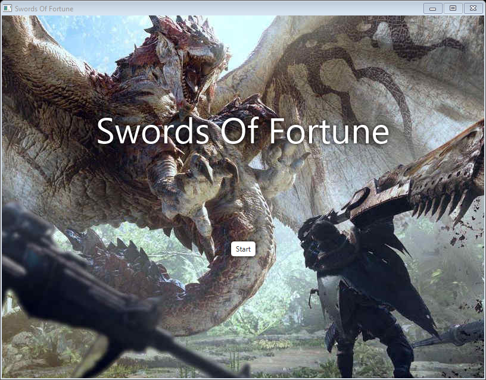
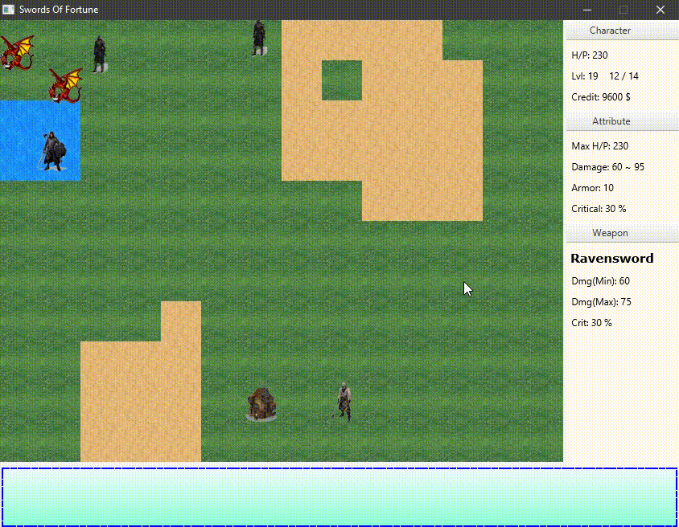
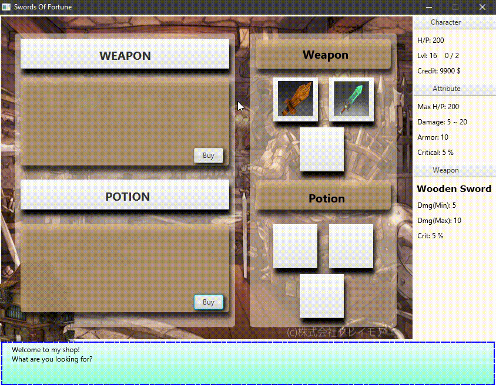
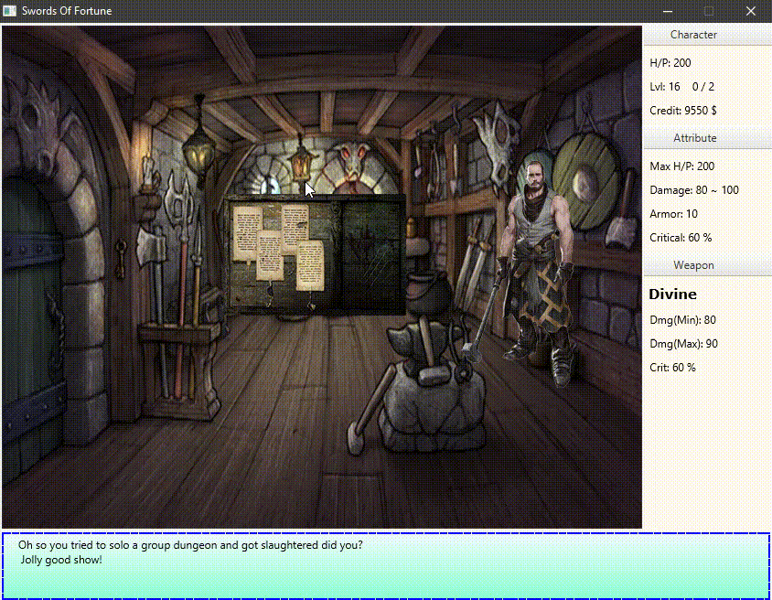

# RPG Game

Welcome to the simple RPG Game. This project is a simple RPG game implemented using Java. 
Some simple game instructions:
1. W S A D -> UP DOWN LEFT RIGHT
2. Z X -> Enter and exit NPC scene
3. Q E -> Enter and exit shop
4. ENTER -> Dialog

## Getting Started

**This program only compatible with JavaSE 1.8**

Here is a guideline to help you get started to run this program.
1. Clone this repository
2. Run the main method in src/Game.java

** *No project management such as Maven and Gradle is used in this project since no library is used in this program*

## Folder Structure

The workspace contains two folders by default, where:

- `src`: the folder to maintain sources
- `lib`: the folder to maintain dependencies

Meanwhile, the compiled output files will be generated in the `bin` folder by default if VS Code is used.

## Game Scenes

Mobbing

Shopping

Quest

Bossing

